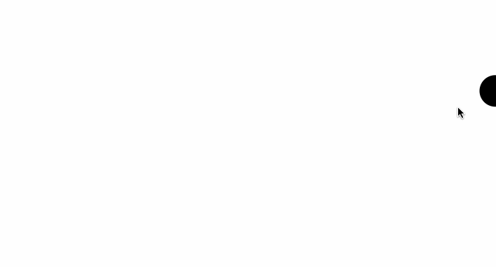

# A program the follows your mouse!

This was a simple functionality created while following a React/D3 Data Visualization course created by freecodecamp.
This application uses react and rollup.config.js to build the application

